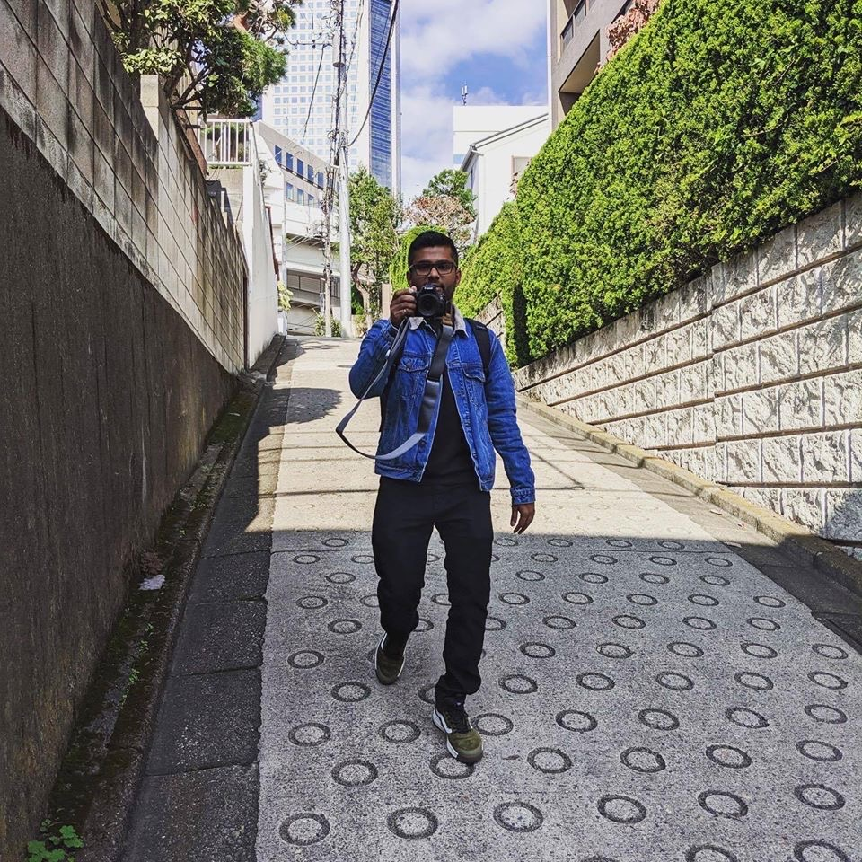
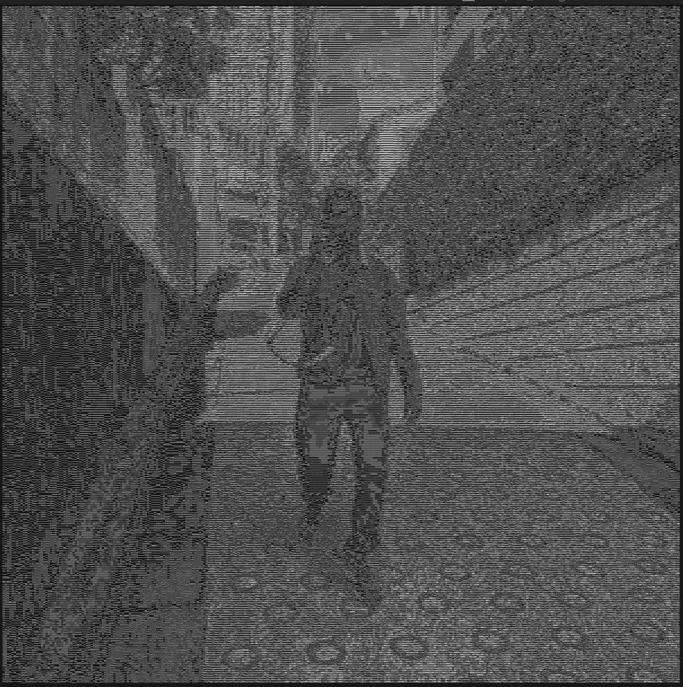

# ascii-art

This project parses an image and converts it into ASCII art. Project inspiration from - https://robertheaton.com/2018/06/12/programming-projects-for-advanced-beginners-ascii-art/

This is the original image:

And this is an example of ASCII art:

## Project Requirements

1. Input image and parse image into pixel matrix
2. Convert pixel matrix into ascii art
3. Save output in a file type (text or image)

## License
[MIT](https://choosealicense.com/licenses/mit/)